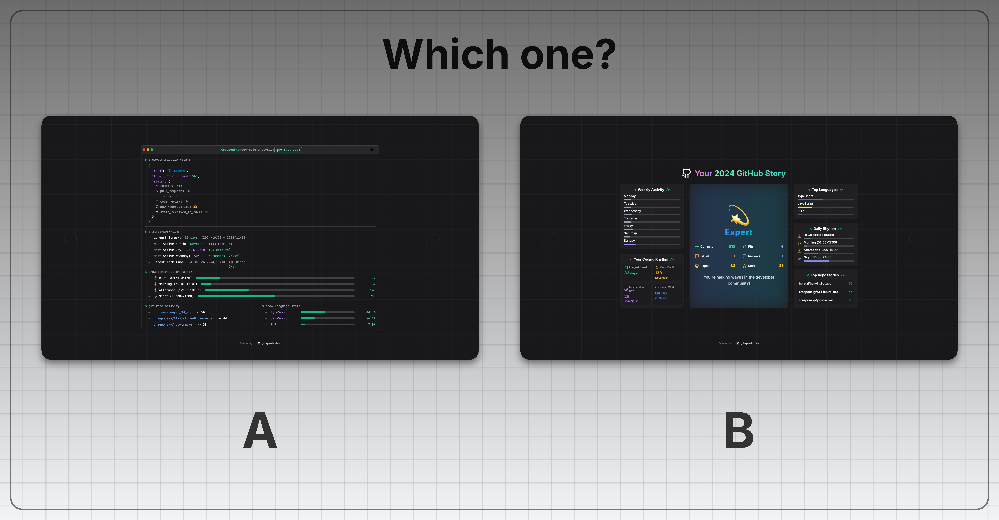
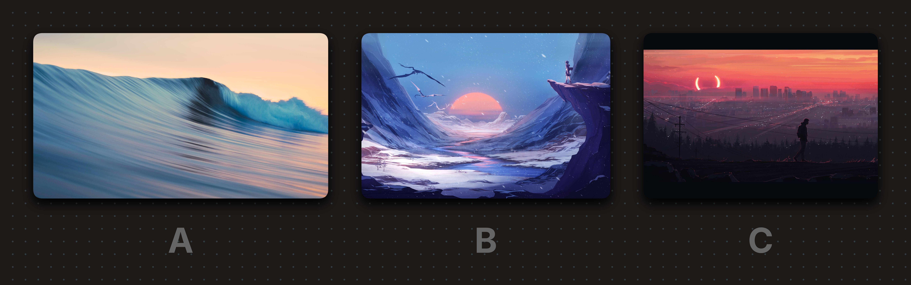

# Which Choice

A simple yet powerful image comparison tool that helps you create beautiful comparison images in seconds. Perfect for product comparisons, design choices, or any scenario where you need to showcase multiple options side by side.

Try it now and transform your decision-making process into a visually appealing experience!

## Preview





## Getting Started

### Installation & Setup

1.  **Clone the repository:**
    ```bash
    git clone https://github.com/creeponsky/which-choice.git
    cd which-choice
    ```
    (Remember to replace `YOUR_USERNAME` with your actual GitHub username!)

2.  **Install dependencies:**
    ```bash
    npm install
    ```

3.  **Run the development server:**
    ```bash
    npm run dev
    ```

Open [http://localhost:3000](http://localhost:3000) with your browser to see the result.

## Deploy to Vercel

You can deploy this project to Vercel with a single click:

[](https://vercel.com/new/clone?repository-url=https%3A%2F%2Fgithub.com%creeponsky%2Fwhich-choice&project-name=which-choice&repository-name=which-choice)
